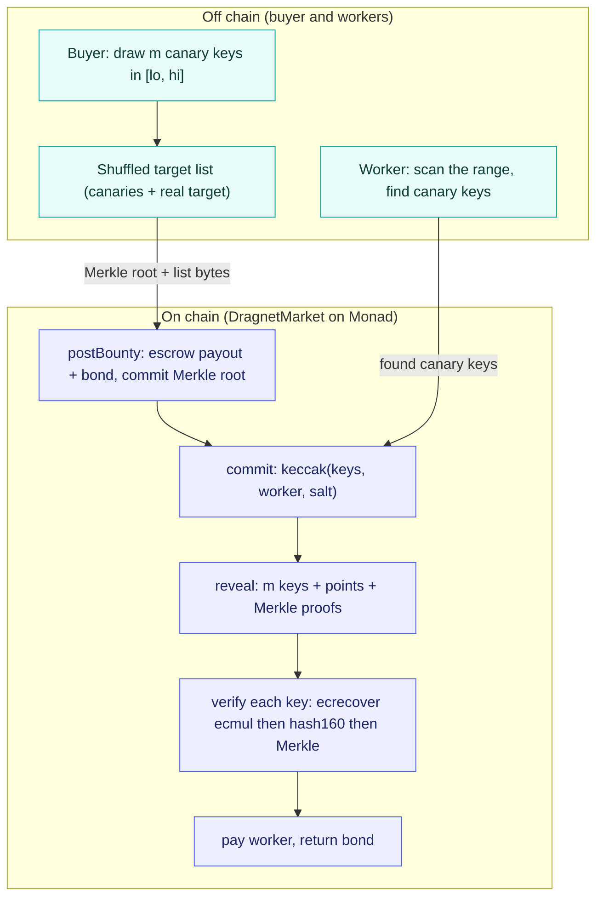

<p align="center"></p>

<h1 align="center">Dragnet</h1>

<p align="center">
A verifiable exclusion market for secp256k1 keyspace search, where the contract
checks a proof of exhaustive search using the ecrecover precompile and canary game
theory, not a trusted pool and not a zero-knowledge circuit.
</p>

<p align="center">Built for the Spark BuildAnything hackathon on Monad.</p>

<p align="center">


</p>

A live local run: a cheat that skips part of the range earns nothing, while an
honest worker proves full coverage and is paid.

```text
2. Cheat worker skips the top of the range (misses a canary)
   scan done: found 4/5 canaries
   reveal rejected on-chain: LengthMismatch. Earned zero.

3. Honest worker scans the whole range and proves coverage
   scan done: found 5/5 canaries
   coverage proven; withdrawing payout

Result
cheat worker    found 4/5, revert=LengthMismatch, earned 0 MON
honest worker A found 5/5, paid=true, earned 2 MON (withdrawn to wallet)
buyer bond returned (claimable): 1 MON
bounty status: Paid, winner 0x70997970C51812dc3A010C7d01b50e0d17dc79C8
```

## 🎯 The problem

The Bitcoin puzzle challenge still holds a large prize across dozens of unsolved
addresses, each one a private key sitting in a known power-of-two range. People
pool compute to sweep those ranges, but every pool runs on trust. A worker claims
it scanned a slice of the keyspace and the operator claims it will pay, and nobody
can check either claim. You pay for exclusion data (proof that the key is not in a
range) that you cannot verify, and a worker can bill you for coverage it never did.

The usual fix is to trust the operator harder: reputations, dashboards, promises.
None of that turns "I scanned it" into something a contract can check. The missing
piece is a way to prove that a range was actually searched, end to end, without
revealing anything a competitor could reuse and without a trusted referee.

## 🛰 What it does

- **Posts a range bounty with hidden canaries.** The buyer draws `m` secret canary
  private keys uniformly from the range `[lo, hi]`, computes their addresses, and
  publishes a shuffled target list mixing canaries with the real target. The
  contract only stores the Merkle root, escrows a payout, and escrows a bond.
- **Proves exhaustive search on chain.** A worker scans the range, finds the canary
  keys, and reveals `m` distinct in-range keys. The contract derives each public key
  with the ecrecover ecmul trick, hashes it to a Bitcoin `hash160` with the sha256
  and ripemd160 precompiles, and checks Merkle membership. No ZK circuit.
- **Pays only for complete coverage.** Miss one canary and the reveal cannot be
  formed, so the payout is zero. Skipping 10 percent of the range probabilistically
  costs a canary (see the table below), so a full honest scan is the only paying
  strategy.
- **Bonds the buyer against cheating too.** If no worker finishes, the buyer must
  open the bounty by revealing valid in-range canaries to reclaim the escrow. A
  buyer who planted unfindable, out-of-range canaries cannot open, and a worker that
  committed can slash the bond.
- **Front-running resistant.** A commit binds the reveal to the worker's address and
  forces it into a later block, so a mempool observer cannot steal a reveal.

## 🧭 How it works



Legend: teal is off chain, indigo is on chain.

The diagram is the happy path. The other paths are enforced too. A partial scan
reveals fewer than `m` keys and the reveal reverts with `LengthMismatch`, so the
worker earns nothing and the bounty stays open. After the claim window, an unclaimed
bounty is opened by the buyer with a valid set of canary keys, which refunds payout
plus bond; a buyer who cannot open forfeits the bond to a worker that committed,
after the open window, through `slash`. Funds move by pull payment: settlement
credits balances and each party calls `withdraw`, so one reverting recipient cannot
block another's money.

### The on-chain verification of one revealed key

The EVM cannot multiply a scalar by the secp256k1 generator, so the contract
recovers the public key through the ecrecover precompile, then hashes it exactly as
Bitcoin does. Every step is a precompile, which is why this needs no ZK.

| Step | EVM primitive | What it establishes |
| ---- | ------------- | ------------------- |
| `ecrecover(0, 27, GX, k*GX mod N)` | ecrecover (0x01) | the address of `k*G`, via the ecmul trick |
| bind supplied `(px, py)` to that address | keccak256 | the caller's point really is `k*G` |
| on-curve check `y^2 = x^3 + 7` | mulmod | the point is a valid secp256k1 point |
| `ripemd160(sha256(0x02\|0x03 \|\| px))` | sha256 (0x02), ripemd160 (0x03) | the Bitcoin `hash160` of the key |
| sorted-pair Merkle proof | keccak256 | the address is in the committed target list |

The full recovery costs roughly 6k gas per key (measured in the test suite), so a
50-canary reveal is well within a block.

## 🔐 Why cheating does not pay

Canaries are uniform in the range, so a worker that covers a fraction `f` finds each
canary with probability `f` and must find all `m`. The probability of getting paid,
which is also the expected payout fraction, is `f^m`. An honest full scan means
`f = 1`, so honest workers are always paid; the penalty falls only on skippers.

| coverage `f` | `m = 10` | `m = 20` | `m = 50` |
| ------------ | -------- | -------- | -------- |
| 0.99         | 0.904    | 0.818    | 0.605    |
| 0.95         | 0.599    | 0.358    | 0.077    |
| 0.90         | 0.349    | 0.122    | 0.0052   |
| 0.80         | 0.107    | 0.0115   | 0.000014 |

At `m = 50`, skipping 10 percent pays out about 0.5 percent of the time and skipping
20 percent is about 1 in 70,000. The buyer tunes `m` against reveal gas.

## 🧪 Reproduce it

Prerequisites: [Bun](https://bun.sh) 1.3 or newer and
[Foundry](https://book.getfoundry.sh) (forge and anvil). Versions used here: Bun
1.3.14, Foundry 1.7.1, solc 0.8.28, forge-std 1.16.2, viem 2, @noble/curves 1.9.

```bash
bun install
bun run setup:contracts              # vendors forge-std by tarball (no git submodules)

cd contracts && forge test           # 31 contract tests: crypto, lifecycle, adversarial
cd .. && bun test packages/crypto    # 17 crypto tests: parity with the contract
```

Success looks like `forge test` reporting `31 passed` and `bun test` reporting
`17 pass`. The contract tests include the showcase cases: a cheat with a missing
canary earns zero, and a buyer that plants unfindable canaries is slashed.

Run the three-worker demo end to end against a local node:

```bash
anvil --block-time 1                 # terminal 1
# terminal 2:
DRAGNET_RPC_URL=http://127.0.0.1:8545 bun run packages/demo/src/cli.ts
```

The demo deploys the contract, posts a bounty over `[1, 8000]` with 5 canaries, then
runs a cheat and two honest workers. Success is the cheat earning `0 MON` with revert
`LengthMismatch` while honest worker A is paid `2 MON`. The same flow runs as an
automated test: `DRAGNET_TEST_RPC=http://127.0.0.1:8545 bun test packages/demo`
(3 tests: honest paid, cheat earns zero, buyer refund).

## 🚀 Deploy to Monad

Fund a key with testnet MON from [faucet.monad.xyz](https://faucet.monad.xyz), then:

```bash
cd contracts
PRIVATE_KEY=0xyourkey forge script script/Deploy.s.sol \
  --rpc-url https://testnet-rpc.monad.xyz --broadcast
```

Set `DRAGNET_MARKET` to the deployed address (see `.env.example`), then drive it with
the clients: `bun run packages/buyer/src/cli.ts post --lo 1 --hi 8000 --m 5 --payout 2
--bond 1 --claim 3600 --open 3600` and `bun run packages/scanner/src/cli.ts <bountyId>`.

## ⚠️ What is real and what is not

- **Coverage fraud is fixed; finder-absconds is not, across chains.** Dragnet proves
  a range was exhaustively searched. It does not force a worker who finds the real
  Bitcoin key to hand it over, because that key unlocks value on Bitcoin, not Monad.
  Coverage is proven by revealing canaries the buyer already knows, never the real
  target, so the two concerns are decoupled by design. For a bounty whose prize sits
  in the contract, the split is enforced on chain and the abscond problem goes away.
- **Not yet deployed to Monad.** The contract compiles, all tests pass, and the
  deploy script is provided, but the on-chain address is produced by the operator
  running the deploy step above. Until then there is no live address to cite.
- **The scanner is TypeScript, sized for demo ranges.** It walks the curve one point
  addition per key. That is fine up to a few million keys for a live demo; puzzle-71
  scale (2^70 keys) needs a native or GPU scanner. The scanner is swappable; the
  contract and proof do not change.
- **Single winner per bounty.** The first valid reveal takes the payout; a per-worker
  split is a noted extension, not in this version.
- **The local demo uses public anvil dev accounts.** They hold no real value and
  exist only on the local node.
- **A web dashboard is the next phase.** The system is contracts plus CLIs today; a
  Next.js dashboard for posting and watching bounties is planned and gated on a design
  pass.

## 🧬 Prior art and related work

- **Keyspace pools** (for example community puzzle pools): coordinate range sweeps but
  settle on operator trust, with no on-chain proof of coverage. Dragnet replaces the
  trust with a checkable proof.
- **keyhunt and VanitySearch**: fast secp256k1 scanners. They are the engine a worker
  would run; Dragnet is the market and the proof layer around such an engine, not a
  replacement for it.

## 📦 Repository layout

```
contracts/          Foundry project: Secp256k1, MerkleProof, DragnetMarket, tests, deploy
packages/crypto/    secp256k1, hash160, Merkle, canary generation (parity with the contract)
packages/sdk/       viem client, chain configs, generated ABI, env config
packages/scanner/   the worker: range scan, commit, reveal (honest and cheat)
packages/buyer/     post a bounty and open it later
packages/demo/      end-to-end tests and the three-worker demo
docs/               build plan and assets
scripts/            forge-std setup and ABI generation
```

## 📜 License

MIT. See [LICENSE](LICENSE).

## 🏆 Hackathon context

Built for the Spark BuildAnything hackathon (Monad). The problem is one the author
actually has: paying for keyspace coverage with no way to check it. The single real
feature, a contract that decides whether an exhaustive search happened and pays
accordingly, runs and is tested end to end.
